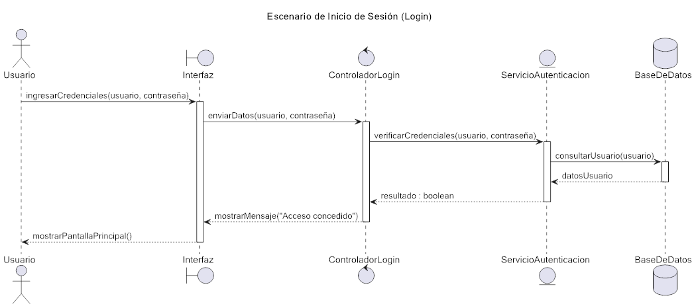

# Modelo 4+1 basado en Kruchten

---

## 1. Vista Lógica

### Diagramas

- **Diagrama de clases**  
  

- **Casos de uso**  
  

- **Diagrama de secuencia**  
  

---

## 2. Vista de Procesos

### Diagramas

- **Diagrama de actividad**  
  

---

## 3. Vista de Desarrollo

### Diagramas

- **Diagrama de paquetes**  
  

- **Diagrama de componentes**  
  

- **Diagrama unificado**  
  

---

## 4. Vista Física

### Diagramas

- **Diagrama de despliegue**  
  

- **Diagrama de topología**  
  

---

## 5. Escenarios (+1)

### Diagramas

- **Desarrollo de casos de uso - Logueo**  
  

---
